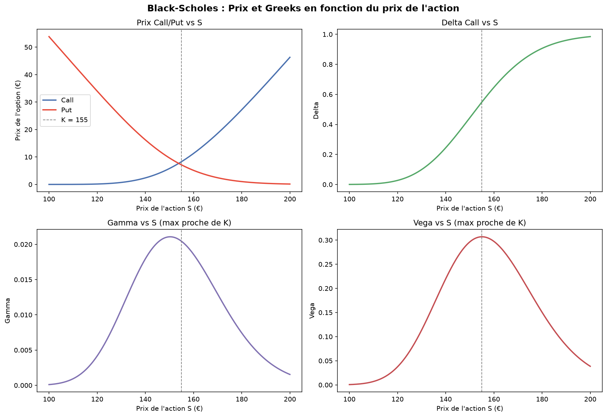

# Black-Scholes Option Pricer

Implémentation from scratch du modèle Black-Scholes pour le pricing
d'options européennes (call/put), avec calcul des Greeks et visualisation
des sensibilités.

## Méthodologie

- Calcul des facteurs d1 et d2 selon la formule de Black-Scholes
- Pricing du call et du put via la fonction de répartition normale
- Calcul des Greeks : Delta, Gamma, Vega, Theta
- Visualisation du prix et des sensibilités en fonction du prix du sous-jacent

## Résultats (exemple)

Paramètres : S=150€, K=155€, T=3 mois, r=3%, σ=25%

| Métrique | Call | Put |
|---|---|---|
| Prix | 5.80 € | 9.65 € |
| Delta | 0.4444 | -0.5556 |
| Gamma | 0.0211 | 0.0211 |
| Vega | 0.2963 | 0.2963 |
| Theta (par jour) | -0.0456 | -0.0329 |

## Visualisations



Le prix du call croît avec S, le put décroît. Gamma et Vega sont
maximaux autour du prix d'exercice K, là où l'incertitude sur
l'exercice de l'option est la plus forte.

## Stack technique

Python · NumPy · SciPy · Matplotlib

## Lancer le projet

```bash
pip install -r requirements.txt
python black_scholes.py
```

## Limites du modèle

- Suppose une volatilité constante (pas de smile de volatilité)
- Valable uniquement pour les options européennes (exercice à maturité uniquement)
- Suppose des taux d'intérêt constants et l'absence de dividendes
